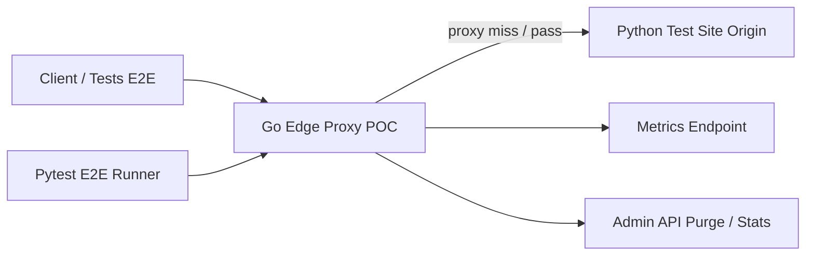
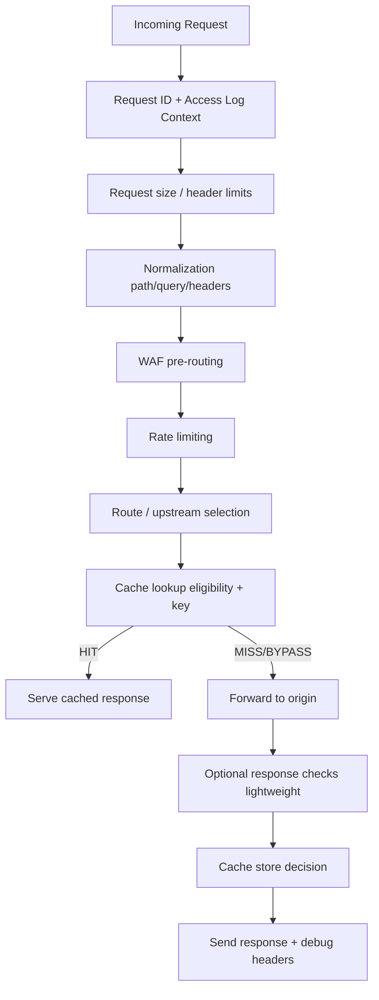

# Instructions.md

## Rôle et objectif

Tu es GitHub Copilot (mode génération de projet complet).  
Ta mission est de **générer un POC fonctionnel, testable et documenté** d’un **reverse proxy HTTP avec cache + WAF + rate limiting**, inspiré des fonctionnalités réalisables d’un edge proxy moderne (type Cloudflare-like), **sans DNS autoritatif**, **sans anycast**, **sans anti-DDoS L3/L4 global**, et **sans promesse d’équivalence produit**.

Le but est un **livrable professionnel** orienté **stabilité / scalabilité / observabilité**, **déployable via Docker Compose**, avec :

- un **proxy principal en Go** (langage retenu pour le POC)
- un **site de test Python** complet (pour produire des cas réalistes)
- une **batterie de tests Python** (E2E + non-régression)
- un **cahier des charges complet** généré en premier (langage naturel + schémas + bullet points)
- une **documentation complète** (install, usage, architecture, sécurité, limites, tests)

---

## Choix du langage (imposé pour ce POC)

### Langage retenu : Go (pour le proxy principal)

Tu dois implémenter le proxy en **Go**, pas en Rust, pour ce POC.

### Justification (à respecter dans les docs)
Le choix Go est motivé par :
- meilleur **time-to-market** pour un POC pro
- excellent support réseau / HTTP / observabilité
- déploiement simple (binaire unique)
- productivité élevée pour itérer sur :
  - cache correctness
  - pipeline de requête
  - règles WAF
  - tests d’intégration
  - metrics/logs

### Python (obligatoire)
- **Python** pour le **site de test**
- **Python** pour la **batterie de tests E2E**

---

## Contraintes globales (très importantes)

### Ce que le projet DOIT être
- **fonctionnel**
- **testable automatiquement**
- **déployable via Docker Compose**
- **modulaire**
- **documenté**
- **orienté robustesse**
- **sans faux claims marketing**

### Ce que le projet NE DOIT PAS faire
- prétendre être équivalent à Cloudflare
- implémenter DNS autoritatif
- implémenter anycast global
- implémenter anti-DDoS L3/L4 volumétrique
- implémenter un CDN multi-PoP distribué
- implémenter HTTP/3/QUIC si cela compromet la stabilité du POC
- cacher du contenu privé par défaut

### Priorités d’ingénierie (ordre strict)
1. **Correctness**
2. **Sécurité**
3. **Observabilité**
4. **Stabilité**
5. **Scalabilité locale**
6. **Performance**
7. **Ergonomie**

---

## Exécution demandée (ordre de travail obligatoire)

Tu dois travailler **dans cet ordre** :

### Phase 0 — Générer d’abord le cahier des charges complet
Avant toute implémentation, génère un **cahier des charges** en langage naturel, structuré, avec schémas et bullet points.

Le cahier des charges doit inclure au minimum :
- objectifs
- périmètre
- non-objectifs
- architecture cible
- pipeline de requête
- stratégie de cache
- stratégie WAF
- sécurité et limites
- plan de tests
- critères d’acceptation
- plan de livraison
- risques techniques et mitigations
- backlog v1 / v2 / v3

### Phase 1 — Générer la structure du repo
Créer l’arborescence complète (proxy Go, site Python, tests Python, docs, compose, scripts).

### Phase 2 — Implémenter le proxy Go (v1 fonctionnelle)
Priorité aux fonctionnalités cœur :
- reverse proxy
- cache HTTP (safe)
- WAF règles simples
- rate limiting
- logs/metrics
- health/readiness
- config robuste

### Phase 3 — Implémenter le site de test Python
Site complet avec endpoints dédiés pour déclencher et vérifier tous les comportements.

### Phase 4 — Implémenter les tests Python E2E
Tests sur l’infra complète via Docker Compose.

### Phase 5 — Finaliser la documentation
README + docs techniques + guide de tests + limitations + roadmap.

---

## Livrables attendus (obligatoires)

### 1) Proxy reverse cache/WAF en Go
Un POC “pro-grade style” (sans features impossibles hors scope), avec :
- reverse proxy HTTP
- cache HTTP côté edge
- WAF configurable
- rate limiting
- observabilité
- dockerisation
- configuration externe
- tests unitaires Go (minimum sur modules critiques)

### 2) Site de test Python
Un site de test “riche” servant d’origine (origin) avec endpoints réalistes pour valider :
- cacheable/non-cacheable
- cookies/session
- auth
- API JSON
- pages dynamiques
- erreurs
- timeout
- headers spécifiques
- ETag / Last-Modified
- upload
- webhooks (non cacheables)
- endpoints vulnérables de test (simulés) pour WAF

### 3) Programme de tests Python (E2E)
Une batterie de tests qui lance des requêtes contre le proxy et vérifie :
- cache HIT/MISS/BYPASS
- respect des règles WAF
- rate limiting
- timeouts upstream
- purge cache
- headers de debug
- non-régression sur cas dangereux
- comportement sous charge légère (smoke concurrent)

### 4) Cahier des charges complet
Généré en premier, documenté en français (ou bilingue FR/EN si tu veux), avec :
- schémas Mermaid
- bullet points
- checklist d’acceptation
- plan de test
- risques
- limites

### 5) Documentation complète
Inclure :
- installation locale
- exécution Docker Compose
- configuration
- guide de debug
- interprétation des métriques/logs
- limites de sécurité
- roadmap v2/v3

---

## Arborescence cible (à générer)

Adapte si nécessaire, mais garde une structure professionnelle proche de celle-ci :

```text
edge-proxy-poc/
├── README.md
├── LICENSE
├── Makefile
├── docker-compose.yml
├── .env.example
├── docs/
│   ├── 00-cahier-des-charges.md
│   ├── 01-architecture.md
│   ├── 02-pipeline-requete.md
│   ├── 03-cache-strategy.md
│   ├── 04-waf-strategy.md
│   ├── 05-threat-model.md
│   ├── 06-test-plan.md
│   ├── 07-operations-runbook.md
│   ├── 08-limitations-roadmap.md
│   └── diagrams/
│       ├── architecture.mmd
│       ├── request-flow.mmd
│       └── test-topology.mmd
├── configs/
│   ├── proxy.dev.yaml
│   ├── proxy.test.yaml
│   ├── rules.waf.yaml
│   ├── cache-rules.yaml
│   └── rate-limit.yaml
├── scripts/
│   ├── up.sh
│   ├── down.sh
│   ├── test-e2e.sh
│   ├── smoke.sh
│   └── purge-cache.sh
├── proxy/
│   ├── Dockerfile
│   ├── go.mod
│   ├── go.sum
│   ├── cmd/
│   │   └── edgeproxy/
│   │       └── main.go
│   ├── internal/
│   │   ├── app/
│   │   ├── config/
│   │   ├── server/
│   │   ├── middleware/
│   │   ├── proxy/
│   │   ├── cache/
│   │   ├── waf/
│   │   ├── ratelimit/
│   │   ├── upstream/
│   │   ├── observability/
│   │   ├── admin/
│   │   ├── normalize/
│   │   ├── security/
│   │   └── util/
│   ├── pkg/
│   │   └── api/
│   └── tests/
│       ├── unit/
│       └── integration/
├── testsite/
│   ├── Dockerfile
│   ├── requirements.txt
│   ├── app/
│   │   ├── main.py
│   │   ├── cache_cases.py
│   │   ├── auth_cases.py
│   │   ├── waf_cases.py
│   │   ├── static/
│   │   │   ├── app.v1.js
│   │   │   ├── styles.v1.css
│   │   │   └── image.png
│   │   └── templates/
│   │       ├── index.html
│   │       └── profile.html
│   └── tests/
│       └── sanity_testsite.py
└── e2e/
    ├── Dockerfile
    ├── requirements.txt
    ├── pytest.ini
    ├── conftest.py
    ├── utils/
    │   ├── client.py
    │   ├── assertions.py
    │   └── polling.py
    ├── tests/
    │   ├── test_cache_basic.py
    │   ├── test_cache_headers.py
    │   ├── test_cache_bypass_cookie_auth.py
    │   ├── test_waf_block_allow_shadow.py
    │   ├── test_rate_limit.py
    │   ├── test_upstream_timeout.py
    │   ├── test_purge.py
    │   ├── test_metrics_health.py
    │   ├── test_normalization_bypass_cases.py
    │   └── test_concurrency_smoke.py
    └── run_tests.py
````

---

## Positionnement technique (important)

Le projet est un **reverse proxy L7 local / mono-région / mono-instance (v1)** avec ambition de bonnes pratiques “pro-grade”, mais **pas** un CDN mondial.

### Formulation à utiliser dans la documentation

* “Cloudflare-like features (subset)”
* “Edge proxy POC”
* “Reverse proxy cache/WAF”
* “Non equivalent to Cloudflare”

Ne pas écrire :

* “Cloudflare clone”
* “Cloudflare compatible”
* “Cloudflare replacement” (sans précision de limites)

---

## Architecture cible (base à implémenter)

### Vue macro



### Pipeline de requête (ordre recommandé)



---

## Périmètre fonctionnel v1 (obligatoire)

## A. Reverse proxy HTTP (Go)

### Fonctionnalités minimales

* reverse proxy HTTP/1.1
* support HTTP/2 côté client **si simple et stable**
* forwarding vers origin configurable
* gestion des timeouts :

  * dial timeout
  * TLS handshake timeout (si TLS upstream)
  * response header timeout
  * idle timeout
  * read/write timeout côté serveur
* propagation contrôlée des headers (forwarded headers)

### Exigences

* pas de panic en trafic normal/malveillant
* graceful shutdown
* logs structurés JSON
* request ID unique par requête

---

## B. Cache HTTP edge (Go)

### Objectif

Mettre en cache **uniquement ce qui est sûr** dans v1, avec comportement explicite et testable.

### Règles v1 (obligatoires)

* méthodes cacheables : **GET** et **HEAD** uniquement
* bypass par défaut si présence de :

  * `Authorization`
  * `Cookie` (sauf règle explicite ultra ciblée)
* ne jamais cacher si réponse contient :

  * `Cache-Control: no-store`
  * `Cache-Control: private`
  * `Set-Cookie` (par défaut v1)
* ne pas cacher les réponses non-2xx (par défaut v1)
* cache key par défaut :

  * méthode (GET/HEAD harmonisée si besoin)
  * host
  * path normalisé
  * query string normalisée (ordre stable)
  * `Accept-Encoding` (au minimum)
* exposer headers de debug :

  * `X-Edge-Cache: HIT|MISS|BYPASS|STORE|EXPIRED`
  * `X-Edge-Cache-Key` (optionnel en mode debug)
  * `X-Request-ID`

### TTL

* TTL configurable par règles (path/extension)
* fallback TTL court configurable
* possibilité de bypass cache par règle

### Stockage v1

* backend mémoire (obligatoire)
* interface pour backend futur (disk/redis) (obligatoire)
* contrôle de taille max cache (count + bytes)
* éviction LRU (ou policy similaire documentée)

### Protection anti-stampede (v1 simplifiée)

* singleflight par cache key (obligatoire)

### Purge (obligatoire)

* purge par clé exacte (admin API)
* purge par préfixe de path (si simple)
* purge all (mode debug/test uniquement, documenter le risque)

---

## C. WAF (Go) — v1 pragmatique

### Objectif

Implémenter un **WAF règles explicites** (pas un moteur signature “magique”), robuste et testable.

### Principes v1

* inspection avant proxy (pre-routing)
* mode **shadow/log-only** supporté
* mode **block**
* règles configurables via YAML
* normalisation minimale cohérente avant match
* limites de body d’inspection (ne pas lire des bodies gigantesques sans borne)

### Règles v1 (obligatoires)

Supporter des règles sur :

* path (exact/prefix/regex bornée)
* method
* headers (présence / valeur / regex)
* query params
* IP source (ou CIDR)
* user-agent
* body (JSON/form-urlencoded) **dans une limite de taille configurable**
* content-type

### Actions v1 (obligatoires)

* `allow`
* `block` (status configurable, ex: 403)
* `log` (shadow)
* `bypass_cache`
* `set_header` (optionnel si simple)
* `rate_limit_override` (optionnel v1.1)

### Exigences sécurité WAF

* **bornes strictes** sur regex (éviter ReDoS)
* normalisation documentée (ordre des transformations)
* logs d’audit des décisions WAF
* test cases de bypass basiques :

  * double encoding simple
  * path traversal encodé
  * payloads SQLi/XSS simulés (patterns simples)
* ne pas prétendre “protection complète OWASP”

---

## D. Rate limiting (Go)

### Objectif

Protéger l’origin et valider le pipeline, pas faire un anti-DDoS global.

### Exigences v1

* token bucket ou leaky bucket
* clés de limitation configurables :

  * IP
  * IP + path prefix
  * header API key (si présent)
* burst configurable
* fenêtre/throughput configurable
* réponse 429 avec headers utiles (`Retry-After` si possible)
* exemptions configurables (allowlist CIDR / paths)

### Observabilité

* compteurs de rejets 429
* métriques par règle (si simple)
* logs de décision rate limit

---

## E. Observabilité / Ops (Go)

### Obligatoire

* endpoint `/healthz`
* endpoint `/readyz`
* endpoint `/metrics` (Prometheus)
* logs JSON
* niveaux de logs configurables
* corrélation par request ID

### Métriques minimales

* requêtes totales (labels : route, method, status)
* latence (histogramme)
* cache hits/misses/bypass/store
* WAF decisions (allow/block/log)
* rate limit allow/deny
* erreurs upstream
* timeouts upstream
* taille cache / nombre d’objets

### Bonus souhaitable (si propre)

* pprof en mode debug
* endpoint admin `/debug/cache/stats`

---

## F. Admin API (Go)

### Objectif

Permettre les opérations de test E2E et l’exploitation locale.

### Endpoints v1 (obligatoires)

* `POST /admin/cache/purge` (exact key ou URL)
* `POST /admin/cache/purge-prefix`
* `POST /admin/cache/purge-all` (mode dev/test)
* `GET /admin/cache/stats`
* `POST /admin/config/reload` (si reload supporté)
* `GET /admin/config/effective` (optionnel, mode debug)

### Sécurité Admin API

* bind séparé (ex: `127.0.0.1` / réseau interne compose)
* token simple via header (obligatoire)
* documenter que ce n’est pas une API publique

---

## G. Configuration (YAML) — obligatoire

### Exigences

* config externe YAML
* validation stricte au démarrage (échouer vite si invalide)
* valeurs par défaut sûres
* erreurs de config lisibles
* séparation claire :

  * proxy runtime
  * cache rules
  * waf rules
  * rate limit rules

### Exemple de structure (à générer et utiliser)

```yaml
# configs/proxy.dev.yaml
server:
  listen_addr: ":8080"
  admin_listen_addr: ":8081"
  read_timeout_ms: 5000
  write_timeout_ms: 10000
  idle_timeout_ms: 60000
  max_header_bytes: 1048576

upstreams:
  - name: testsite
    base_url: "http://testsite:8000"
    connect_timeout_ms: 1000
    response_header_timeout_ms: 3000
    max_idle_conns: 100
    max_idle_conns_per_host: 50

routing:
  default_upstream: "testsite"

security:
  trust_x_forwarded_for: false
  max_body_inspect_bytes: 65536
  max_request_body_bytes: 10485760

cache:
  enabled: true
  max_entries: 5000
  max_bytes: 268435456
  default_ttl_seconds: 30
  respect_origin_cache_control: true
  bypass_on_cookie: true
  bypass_on_authorization: true
  never_store_on_set_cookie: true
  debug_headers: true

admin_api:
  enabled: true
  auth_token: "change-me"
```

### Exemple de règles WAF (YAML)

```yaml
# configs/rules.waf.yaml
mode: "shadow"  # "shadow" | "enforce"

rules:
  - id: "block-path-traversal"
    enabled: true
    phase: "request"
    match:
      any:
        - path_regex: "(?i)(\\.\\./|%2e%2e%2f|%2e%2e/)"
    action:
      type: "block"
      status_code: 403
      log: true

  - id: "block-sqli-basic"
    enabled: true
    phase: "request"
    match:
      any:
        - query_regex: "(?i)(union\\s+select|or\\s+1=1|drop\\s+table)"
        - body_regex: "(?i)(union\\s+select|or\\s+1=1|drop\\s+table)"
    action:
      type: "block"
      status_code: 403
      log: true

  - id: "shadow-xss-basic"
    enabled: true
    phase: "request"
    match:
      any:
        - query_regex: "(?i)(<script|javascript:|onerror=)"
    action:
      type: "log"
      log: true
```

### Exemple de règles de cache (YAML)

```yaml
# configs/cache-rules.yaml
rules:
  - id: "static-assets"
    path_prefix: "/static/"
    methods: ["GET", "HEAD"]
    cache:
      eligible: true
      ttl_seconds: 3600

  - id: "versioned-assets"
    path_regex: "^/assets/.+\\.[a-f0-9]{6,}\\.(js|css)$"
    methods: ["GET", "HEAD"]
    cache:
      eligible: true
      ttl_seconds: 86400

  - id: "api-no-cache"
    path_prefix: "/api/"
    cache:
      eligible: false

  - id: "auth-no-cache"
    path_prefix: "/auth/"
    cache:
      eligible: false

  - id: "webhooks-no-cache"
    path_prefix: "/webhooks/"
    cache:
      eligible: false
```

---

## Site de test Python (origin) — spécification obligatoire

### Stack recommandée

* **FastAPI** + **uvicorn** (ou Flask si tu préfères, mais FastAPI est recommandé)

### Objectif

Le site doit servir de **banc d’essai réaliste** pour valider le proxy.

### Endpoints obligatoires (minimum)

#### Pages / statique

* `GET /` : page HTML simple, cacheable ou non selon headers
* `GET /static/app.v1.js` : asset statique cacheable
* `GET /static/styles.v1.css`
* `GET /static/image.png`

#### API dynamiques

* `GET /api/time` : JSON avec timestamp (non cacheable)
* `GET /api/random` : JSON aléatoire (non cacheable)
* `GET /api/echo` : echo query/headers utiles (test debug)

#### Auth / cookie

* `POST /auth/login` : set cookie de session
* `GET /auth/profile` : retourne contenu dépendant du cookie (non cacheable)
* `GET /private` : nécessite Authorization ou cookie

#### Cache behavior cases

* `GET /cache/public-short` : `Cache-Control: public, max-age=5`
* `GET /cache/public-long` : `Cache-Control: public, max-age=60`
* `GET /cache/no-store` : `Cache-Control: no-store`
* `GET /cache/private` : `Cache-Control: private`
* `GET /cache/with-set-cookie` : réponse avec `Set-Cookie`
* `GET /cache/etag` : support `ETag` / `If-None-Match`
* `GET /cache/last-modified` : support `Last-Modified` / `If-Modified-Since`

#### WAF test cases (simulés, sûrs)

* `GET /search?q=...` : echo query pour tester patterns XSS/SQLi (pas de vraie vulnérabilité)
* `POST /submit` : echo body JSON/form
* `GET /path-test/{value}` : test de normalisation / encodage

#### Robustesse / upstream failures

* `GET /slow?delay_ms=...` : réponse lente
* `GET /error/{code}` : retourne code 4xx/5xx
* `POST /upload` : upload contrôlé (test limites de taille)
* `POST /webhooks/test` : endpoint non cacheable, idempotence non garantie

#### Debug / observabilité

* `GET /debug/headers` : retourne headers reçus (pour vérifier forwarding)
* `GET /healthz`
* `GET /readyz`

### Exigences testsite

* logs simples lisibles
* headers explicites pour faciliter assertions
* comportement déterministe quand nécessaire (ex endpoints versionnés / fixtures)

---

## Batterie de tests Python E2E (obligatoire)

### Stack recommandée

* `pytest`
* `httpx` (ou requests)
* exécution depuis un conteneur `e2e`
* tests lancés contre le proxy, pas directement contre l’origin (sauf tests de référence explicites)

### Tests obligatoires (minimum)

#### 1) Cache basique

* premier GET sur asset statique => `MISS` puis `STORE`
* second GET => `HIT`
* contenu identique
* header `X-Edge-Cache` attendu

#### 2) TTL / expiration

* ressource avec TTL court
* vérifier `HIT` avant expiration
* vérifier `MISS`/refresh après expiration

#### 3) Bypass sur cookie / auth

* requête avec `Cookie` => `BYPASS`
* requête avec `Authorization` => `BYPASS`
* aucune mise en cache de la réponse

#### 4) Respect headers origin

* `no-store` => pas stocké
* `private` => pas stocké
* `Set-Cookie` => pas stocké (v1)

#### 5) WAF shadow / block

* en mode shadow : payload suspect => 200 (origin atteint) + log WAF
* en mode enforce : payload suspect => 403
* payload normal => passe

#### 6) Rate limiting

* burst de requêtes => certaines 429
* vérifier headers et comportement de récupération après délai

#### 7) Upstream timeout

* endpoint `/slow`
* timeout côté proxy => code d’erreur contrôlé (ex 504)
* log/métrique d’upstream timeout incrémenté

#### 8) Purge cache

* stocker une ressource
* purge via admin API
* requête suivante => `MISS`

#### 9) Metrics / health

* `/healthz` OK
* `/readyz` OK
* `/metrics` contient métriques clés

#### 10) Normalization / bypass cases

* variantes encodées de chemins/query
* vérifier cohérence WAF/cache (pas de comportement incohérent évident)

#### 11) Concurrency smoke

* N requêtes concurrentes sur même asset non caché au départ
* vérifier pas d’explosion et comportement stable (singleflight souhaité)
* ratio hits/misses cohérent après warmup

### Exigences de tests

* assertions explicites
* diagnostics utiles en cas d’échec
* timeouts de tests bornés
* pas de dépendance Internet
* entièrement local via Compose

---

## Docker Compose (obligatoire)

### Services minimum

* `proxy` (Go)
* `testsite` (Python)
* `e2e` (Python tests)
* éventuellement `prometheus` en bonus (optionnel)
* éventuellement `grafana` en bonus (optionnel)

### Exigences Compose

* `docker compose up --build` doit fonctionner
* réseaux internes dédiés (front / back) si utile
* volumes pour :

  * configs
  * logs
  * cache (si backend disk plus tard)
* healthchecks Compose sur `proxy` et `testsite`
* dépendances ordonnées (`depends_on` + healthcheck quand possible)

### Commandes attendues (documentées)

* démarrage infra
* exécution tests E2E
* purge cache manuelle
* lecture des logs
* arrêt / cleanup

---

## Cahier des charges (à générer en premier) — contenu détaillé exigé

Créer `docs/00-cahier-des-charges.md` avec **schémas + bullet points + critères d’acceptation**.

## Sections obligatoires du cahier des charges

1. Contexte et objectif
2. Périmètre fonctionnel
3. Hors périmètre / limites
4. Exigences fonctionnelles
5. Exigences non fonctionnelles
6. Architecture globale
7. Pipeline de requête détaillé
8. Politique de cache détaillée
9. Politique WAF détaillée
10. Politique de rate limiting
11. Observabilité et exploitation
12. Sécurité (threat model simplifié)
13. Plan de tests
14. Plan de déploiement local (Compose)
15. Critères d’acceptation (Definition of Done)
16. Risques & mitigations
17. Roadmap v2/v3

## Exigences non fonctionnelles à documenter

* disponibilité locale du POC
* comportement déterministe
* timeouts stricts
* limites mémoire / tailles
* logs exploitables
* métriques minimales
* sécurité par défaut (safe caching)

---

## Documentation complète (obligatoire)

## README principal

Le `README.md` doit couvrir :

* présentation du projet
* limites (très visibles)
* architecture rapide
* démarrage rapide
* exécution des tests
* exemples de config
* endpoints proxy/admin/testsite
* troubleshooting rapide

## Docs techniques

Créer des docs dédiées avec :

* architecture détaillée
* pipeline de requête
* stratégie cache
* stratégie WAF
* modèle de menace simplifié
* plan de tests
* runbook ops local
* roadmap

## Runbook local (obligatoire)

Inclure :

* comment lire les logs
* comment interpréter `X-Edge-Cache`
* comment tester une règle WAF
* comment purger le cache
* comment changer le mode shadow/enforce
* comment simuler un timeout origin
* comment diagnostiquer un `BYPASS`

---

## Exigences de code (qualité)

### Go (proxy)

* architecture modulaire
* pas de giant file monolithique
* interfaces là où utile (cache backend, rule engine)
* context propagation (`context.Context`)
* timeouts partout
* erreurs wrapées proprement
* tests unitaires sur :

  * cache key generation
  * cache eligibility decisions
  * waf rule matching
  * config validation
  * rate limiter logic
* zéro TODO bloquant dans les chemins critiques

### Python (testsite + e2e)

* code clair
* endpoints déterministes pour assertions
* fixtures pytest réutilisables
* helpers de requêtes centralisés
* timeouts explicites dans les tests

---

## Sécurité et robustesse (obligatoire)

### Borne et limitations

Implémenter des limites explicites (configurables) pour :

* taille headers
* taille body
* temps lecture/écriture
* nombre max d’objets en cache
* taille totale cache
* taille max inspectée par WAF
* taille regex / complexité (au minimum documenter + borner usage)

### Headers et forwarding

Documenter et implémenter prudemment :

* `X-Forwarded-For`
* `X-Forwarded-Proto`
* `X-Request-ID`
* ne pas faire confiance aveuglément à `X-Forwarded-For` en entrée client (configurable)

### Cache safety par défaut

Par défaut, privilégier **BYPASS** plutôt que risque de fuite de données.

---

## Plan de réalisation demandé à Copilot (phases détaillées)

## Phase 0 — Spécification

Générer :

* `docs/00-cahier-des-charges.md`
* `docs/01-architecture.md`
* `docs/06-test-plan.md`
* schémas Mermaid

## Phase 1 — Scaffold projet

Générer :

* arborescence
* `docker-compose.yml`
* `Makefile`
* configs de base
* Dockerfiles

## Phase 2 — Proxy Go minimal fonctionnel

Fonctions :

* reverse proxy simple
* logs JSON
* healthz/readyz
* config loading
* tests unitaires config

## Phase 3 — Cache v1

Fonctions :

* cache in-memory
* policy safe
* headers debug
* purge API
* singleflight
* tests unitaires cache + E2E cache

## Phase 4 — WAF v1

Fonctions :

* moteur de règles YAML
* mode shadow/enforce
* règles path/query/header/body simples
* logs de décision
* tests unitaires match + E2E WAF

## Phase 5 — Rate limiting v1

Fonctions :

* limiter configurable
* règles par IP/path
* 429 + metrics
* E2E dédiés

## Phase 6 — Observabilité + docs

Fonctions :

* métriques Prometheus
* docs ops
* runbook
* finalisation README

---

## Critères d’acceptation (Definition of Done)

Le projet est considéré terminé uniquement si **tous** les points suivants sont vrais :

* [ ] `docker compose up --build` démarre `proxy` + `testsite`
* [ ] le proxy route correctement vers le testsite
* [ ] le cache fonctionne (`MISS` puis `HIT`) sur assets statiques
* [ ] le proxy bypass correctement sur `Cookie` / `Authorization`
* [ ] `no-store`, `private`, `Set-Cookie` ne sont pas cachés en v1
* [ ] le WAF fonctionne en mode shadow et enforce
* [ ] le rate limiting renvoie des 429 de manière reproductible
* [ ] l’admin API permet la purge cache
* [ ] `/metrics`, `/healthz`, `/readyz` sont disponibles
* [ ] la batterie de tests Python E2E passe
* [ ] la documentation est complète et cohérente avec le code
* [ ] les limites / non-objectifs sont documentés explicitement

---

## Non-objectifs (à documenter et respecter)

Ne pas implémenter dans v1 (sauf bonus clairement séparé) :

* DNS autoritatif
* anycast
* multi-région / multi-PoP
* cache distribué cohérent
* invalidation globale multi-node
* HTTP/3/QUIC complexe
* WAF signature complet type moteur commercial
* anti-bot / JS challenge
* anti-DDoS L3/L4
* TLS ACME automatique multi-domaine (bonus ultérieur seulement)

---

## Bonus (facultatifs, seulement si la base est stable)

### Bonus v1.1 possibles

* revalidation ETag/If-None-Match côté cache
* stale-while-revalidate local
* circuit breaker upstream
* cache backend disque simple
* dashboard minimal (statistiques)
* mode config reload à chaud
* tests de charge légers supplémentaires

### Bonus v1.2 possibles

* support multi-upstream + failover simple
* sticky routing simple
* rules DSL plus riche
* traces OpenTelemetry (local)

---

## Exigences de livraison et documentation finale

À la fin, fournir :

1. le code complet
2. la doc complète
3. les fichiers de config exemples
4. le site de test Python
5. les tests E2E Python
6. les instructions d’exécution
7. un résumé des limites restantes
8. une roadmap technique v2/v3

---

## Style attendu de génération (important)

* Produire du code **directement exécutable**
* Éviter les placeholders vagues
* Si une partie est simplifiée, la **documenter explicitement**
* Favoriser la lisibilité et la maintenabilité
* Prioriser la sécurité et la stabilité sur les features
* Ne pas “survendre” le résultat

---

## Message final attendu de Copilot (à générer à la fin)

Quand le projet est généré, produire un récapitulatif structuré :

* ce qui a été implémenté
* ce qui a été simplifié
* comment lancer
* comment tester
* limitations connues
* prochaines améliorations recommandées

---

## Point de départ conseillé (si tu dois choisir toi-même)

Commence par :

1. `docs/00-cahier-des-charges.md`
2. `docker-compose.yml`
3. `testsite/app/main.py`
4. `proxy/cmd/edgeproxy/main.go`
5. `proxy/internal/config/*`
6. pipeline reverse proxy minimal
7. cache v1
8. WAF v1
9. rate limiting
10. E2E tests
11. docs finales

Fin de mission.
