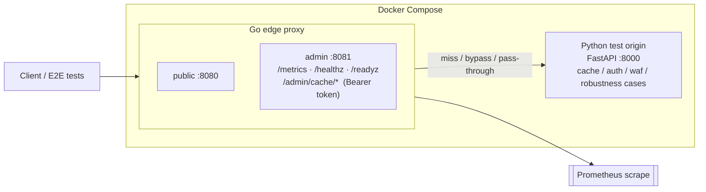
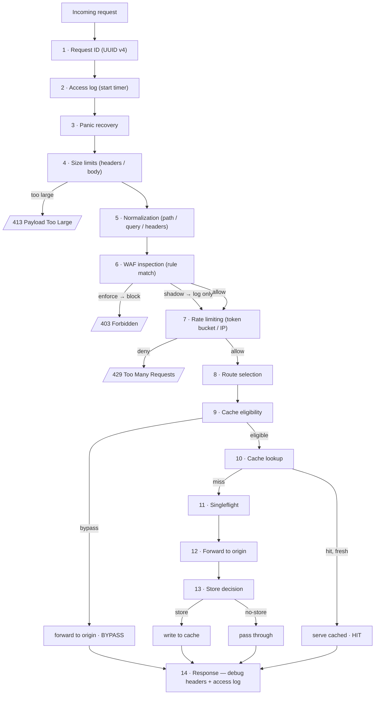

# OpenFlare

**An "edge proxy" you can actually read.** OpenFlare is a small but complete L7 reverse
proxy — HTTP cache, basic WAF, rate limiting, full observability — built as a study of how
a Cloudflare-style edge node works *without* the parts that need a global network (no
authoritative DNS, no anycast, no volumetric DDoS scrubbing, no multi-PoP CDN). Proxy in
**Go**, a realistic **Python** test origin, and a **pytest** E2E suite, all wired up with
Docker Compose.

[]()
[]()
[]()
[](edge-proxy-poc/docs/)
[](edge-proxy-poc/LICENSE)

> **Scope** — this is a POC / architecture exercise, not a production CDN or WAF. It is
> single-instance, cache is in-memory, the WAF is regex-based, there's no TLS termination
> or HTTP/2-3, and no L3/L4 protection. See
> [Limitations & roadmap](edge-proxy-poc/docs/08-limitations-roadmap.md).

---

## Why

"How does an edge proxy actually work?" is best answered by building one small enough to
hold in your head. OpenFlare implements the request pipeline that matters — request IDing,
logging, panic recovery, size limits, normalization, WAF, rate limiting, cache
eligibility/lookup/store with singleflight, upstream forwarding — plus the operational
surface (Prometheus metrics, health/readiness, an authenticated admin API for cache
purge/stats) and a test origin designed to exercise every edge case (cache directives,
cookies/auth bypass, ETag/Last-Modified, slow/erroring endpoints, WAF payloads). The
result is a codebase you can step through, with docs and E2E tests to match.

## Architecture



## Request pipeline



`X-Edge-Cache: HIT | MISS | BYPASS | STORE | ERROR`, `X-Request-ID`, `X-Edge-Cache-TTL`,
`X-Edge-Cache-Age` are emitted when debug headers are on.

## Quick start

```bash
cd edge-proxy-poc
make up            # docker compose up --build -d   (proxy :8080, admin :8081, origin :8000)
make health        # curl http://localhost:8080/healthz
make metrics       # curl http://localhost:8081/metrics
make test-e2e      # docker compose --profile test run --rm e2e   (pytest E2E suite)
make smoke         # quick end-to-end sanity script
make down          # docker compose down -v
```

Cache purge (admin API, `Authorization: Bearer <ADMIN_TOKEN>`):

```bash
curl -X POST http://localhost:8081/admin/cache/purge-prefix \
  -H "Authorization: Bearer change-me" -H "Content-Type: application/json" \
  -d '{"prefix": "/static/"}'
```

Everything (endpoints, config files, debug headers, troubleshooting, full project tree) is
documented in [`edge-proxy-poc/README.md`](edge-proxy-poc/README.md).

## Repository layout

```text
edge-proxy-poc/
├── proxy/        Go reverse proxy — cmd/edgeproxy + internal/{cache,waf,ratelimit,
│                 normalize,proxy,middleware,upstream,admin,observability,config,server}
├── testsite/     Python (FastAPI) origin: cache/auth/waf/api/robustness/debug cases
├── e2e/          Python E2E suite (pytest): cache, headers, WAF, rate-limit, purge,
│                 upstream-timeout, normalization bypass, metrics/health, concurrency
├── configs/      YAML: proxy.*.yaml, rules.waf.yaml, cache-rules.yaml, rate-limit.yaml
├── scripts/      up / down / smoke / test-e2e / purge-cache
├── docs/         00 spec · 01 architecture · 02 pipeline · 03 cache · 04 WAF ·
│                 05 threat model · 06 test plan · 07 runbook · 08 limitations + diagrams/
├── docker-compose.yml · Makefile
Instructions.md   the original project brief (kept for context)
```

## Documentation

`edge-proxy-poc/docs/` — [cahier des charges](edge-proxy-poc/docs/00-cahier-des-charges.md),
[architecture](edge-proxy-poc/docs/01-architecture.md),
[request pipeline](edge-proxy-poc/docs/02-pipeline-requete.md),
[cache strategy](edge-proxy-poc/docs/03-cache-strategy.md),
[WAF strategy](edge-proxy-poc/docs/04-waf-strategy.md),
[threat model](edge-proxy-poc/docs/05-threat-model.md),
[test plan](edge-proxy-poc/docs/06-test-plan.md),
[operations runbook](edge-proxy-poc/docs/07-operations-runbook.md),
[limitations & roadmap](edge-proxy-poc/docs/08-limitations-roadmap.md).

## Status

POC, complete and tested for what it claims to do. Not production-grade — see the scope
note above.

## License

[MIT](edge-proxy-poc/LICENSE)

---

<sub>Part of my work — more at <a href="https://zz0r0.fr">zz0r0.fr</a>.</sub>
