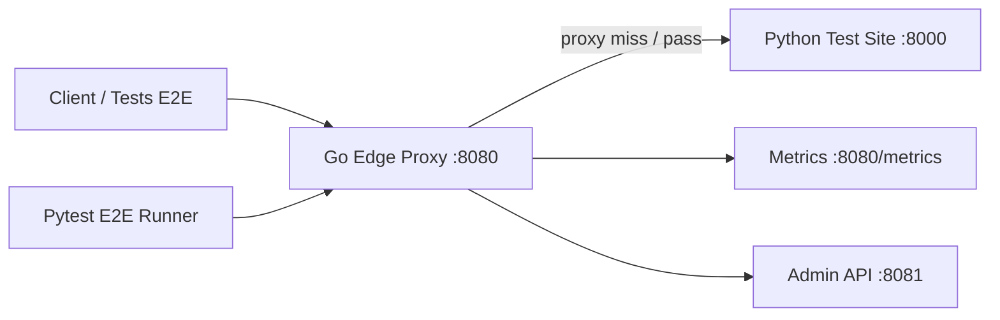
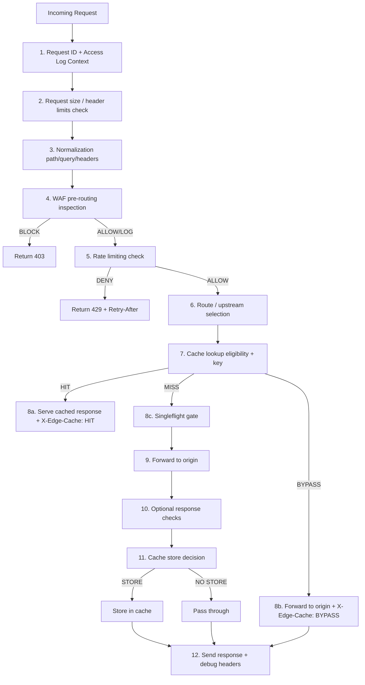

# Cahier des Charges — OpenFlare Edge Proxy POC

## 1. Contexte et objectif

### Contexte

Les services web modernes nécessitent une couche de protection et d'optimisation en amont des serveurs d'origine. Les solutions commerciales (Cloudflare, Fastly, Akamai) offrent ces services à l'échelle mondiale, mais leur complexité et leur coût ne sont pas toujours justifiés pour des déploiements mono-région ou des POCs.

### Objectif

Concevoir et livrer un **POC fonctionnel** d'un reverse proxy HTTP L7 avec :

- **Cache HTTP edge** (safe par défaut)
- **WAF configurable** (règles explicites, mode shadow/enforce)
- **Rate limiting** (protection origin)
- **Observabilité** (métriques Prometheus, logs structurés, health checks)

Le tout déployable via **Docker Compose**, avec un **site de test Python** et une **batterie de tests E2E**.

### Positionnement

- "Cloudflare-like features (subset)"
- "Edge proxy POC"
- "Reverse proxy cache/WAF"
- **Non équivalent à Cloudflare** — mono-instance, mono-région, pas de DNS autoritatif, pas d'anycast, pas d'anti-DDoS L3/L4.

---

## 2. Périmètre fonctionnel

### Inclus dans v1

| Composant | Description |
|-----------|-------------|
| Reverse proxy HTTP | HTTP/1.1 + HTTP/2 côté client, forwarding vers origin configurable |
| Cache HTTP edge | In-memory, safe par défaut, LRU, singleflight, purge API |
| WAF | Règles YAML, mode shadow/enforce, inspection path/query/headers/body |
| Rate limiting | Token bucket, clés IP/path/API-key, 429 + Retry-After |
| Observabilité | Prometheus metrics, logs JSON, health/readiness, request ID |
| Admin API | Purge cache, stats, config reload |
| Site de test Python | FastAPI, endpoints réalistes pour tous les cas de test |
| Tests E2E Python | pytest + httpx, couverture complète des fonctionnalités |
| Documentation | Cahier des charges, architecture, runbook, roadmap |

### Exigences transverses

- Configuration externe YAML avec validation stricte
- Graceful shutdown
- Timeouts configurables partout
- Logs structurés JSON avec corrélation request ID
- Zéro panic en trafic normal ou malveillant

---

## 3. Hors périmètre / Limites

### Non-objectifs v1

| Fonctionnalité | Raison |
|----------------|--------|
| DNS autoritatif | Hors scope POC |
| Anycast global | Infrastructure réseau, hors scope |
| Multi-région / multi-PoP | Mono-instance pour v1 |
| Cache distribué cohérent | Complexité excessive pour POC |
| HTTP/3 / QUIC | Risque de stabilité |
| WAF signatures complètes (OWASP CRS) | Moteur de règles explicites uniquement |
| Anti-bot / JS challenge | Hors scope |
| Anti-DDoS L3/L4 | Nécessite infrastructure réseau dédiée |
| TLS ACME automatique | Bonus ultérieur |
| Invalidation globale multi-node | Mono-instance |

### Limites documentées

- Le cache est **in-memory uniquement** en v1 (interface pour backends futurs)
- Le WAF ne prétend **pas** à une protection OWASP complète
- Le rate limiting est **local** (pas distribué)
- Pas de haute disponibilité native
- Performance non optimisée pour production à haute charge

---

## 4. Exigences fonctionnelles

### 4.1 Reverse proxy

- **RF-PROXY-01** : Forward HTTP/1.1 vers origin configurable
- **RF-PROXY-02** : Support HTTP/2 côté client (si stable)
- **RF-PROXY-03** : Timeouts configurables (dial, TLS handshake, response header, idle, read/write)
- **RF-PROXY-04** : Propagation contrôlée des headers (X-Forwarded-For, X-Forwarded-Proto, X-Request-ID)
- **RF-PROXY-05** : Graceful shutdown (drain des connexions)
- **RF-PROXY-06** : Request ID unique par requête (UUID v4)

### 4.2 Cache HTTP

- **RF-CACHE-01** : Méthodes cacheables : GET et HEAD uniquement
- **RF-CACHE-02** : Bypass si `Authorization` présent
- **RF-CACHE-03** : Bypass si `Cookie` présent (sauf règle explicite)
- **RF-CACHE-04** : Ne pas cacher si réponse contient `Cache-Control: no-store`
- **RF-CACHE-05** : Ne pas cacher si réponse contient `Cache-Control: private`
- **RF-CACHE-06** : Ne pas cacher si réponse contient `Set-Cookie`
- **RF-CACHE-07** : Ne pas cacher les réponses non-2xx
- **RF-CACHE-08** : Cache key = méthode + host + path normalisé + query normalisée + Accept-Encoding
- **RF-CACHE-09** : Headers de debug : `X-Edge-Cache: HIT|MISS|BYPASS|STORE|EXPIRED`
- **RF-CACHE-10** : TTL configurable par règles (path/extension)
- **RF-CACHE-11** : Stockage in-memory avec contrôle taille max (count + bytes)
- **RF-CACHE-12** : Éviction LRU
- **RF-CACHE-13** : Singleflight par cache key (anti-stampede)
- **RF-CACHE-14** : Purge par clé exacte, par préfixe, purge all

### 4.3 WAF

- **RF-WAF-01** : Règles configurables via YAML
- **RF-WAF-02** : Mode shadow (log-only) et enforce (block)
- **RF-WAF-03** : Inspection pre-routing
- **RF-WAF-04** : Règles sur : path, method, headers, query params, IP/CIDR, user-agent, body, content-type
- **RF-WAF-05** : Actions : allow, block (status configurable), log, bypass_cache
- **RF-WAF-06** : Bornes strictes sur regex (anti-ReDoS)
- **RF-WAF-07** : Limite de taille body inspectée configurable
- **RF-WAF-08** : Logs d'audit des décisions WAF
- **RF-WAF-09** : Normalisation documentée avant match

### 4.4 Rate limiting

- **RF-RL-01** : Token bucket par clé configurable
- **RF-RL-02** : Clés : IP, IP+path prefix, header API key
- **RF-RL-03** : Burst configurable
- **RF-RL-04** : Réponse 429 avec `Retry-After`
- **RF-RL-05** : Exemptions configurables (allowlist CIDR/paths)
- **RF-RL-06** : Compteurs de rejets 429

### 4.5 Observabilité

- **RF-OBS-01** : Endpoint `/healthz`
- **RF-OBS-02** : Endpoint `/readyz`
- **RF-OBS-03** : Endpoint `/metrics` (Prometheus)
- **RF-OBS-04** : Logs JSON structurés avec niveaux configurables
- **RF-OBS-05** : Corrélation par request ID
- **RF-OBS-06** : Métriques : requêtes totales, latence, cache hits/misses, WAF decisions, rate limit, erreurs upstream

### 4.6 Admin API

- **RF-ADMIN-01** : `POST /admin/cache/purge` (clé exacte)
- **RF-ADMIN-02** : `POST /admin/cache/purge-prefix`
- **RF-ADMIN-03** : `POST /admin/cache/purge-all`
- **RF-ADMIN-04** : `GET /admin/cache/stats`
- **RF-ADMIN-05** : Authentification par token
- **RF-ADMIN-06** : Bind séparé (réseau interne)

---

## 5. Exigences non fonctionnelles

| Exigence | Détail |
|----------|--------|
| Disponibilité locale | Le POC doit démarrer et fonctionner sans dépendance Internet |
| Comportement déterministe | Résultats reproductibles pour les tests |
| Timeouts stricts | Tous les appels réseau ont des timeouts configurables |
| Limites mémoire | Taille cache bornée, taille body inspectée bornée |
| Logs exploitables | JSON structuré, niveaux configurables |
| Métriques minimales | Prometheus, couvrant proxy/cache/WAF/rate-limit |
| Sécurité par défaut | BYPASS plutôt que risque de fuite de données |
| Configuration validée | Échec rapide si config invalide au démarrage |
| Déploiement simple | `docker compose up --build` suffit |

---

## 6. Architecture globale

### Vue macro



### Composants

| Service | Technologie | Port | Rôle |
|---------|-------------|------|------|
| proxy | Go | 8080 (public), 8081 (admin) | Reverse proxy + cache + WAF + rate limit |
| testsite | Python/FastAPI | 8000 | Origin de test |
| e2e | Python/pytest | - | Tests E2E |

### Réseaux Docker

- **frontend** : client → proxy
- **backend** : proxy → origin

---

## 7. Pipeline de requête détaillé



### Étapes détaillées

1. **Request ID** : UUID v4 généré, ajouté aux logs et headers
2. **Size limits** : Vérification taille headers et body max
3. **Normalization** : Path (double slashes, dot segments), query (tri alphabétique, décodage), headers (lowercase)
4. **WAF** : Match des règles configurées, action block/log/allow
5. **Rate limiting** : Token bucket lookup par clé, burst check
6. **Routing** : Sélection de l'upstream (un seul en v1)
7. **Cache lookup** : Vérification éligibilité (méthode, headers), calcul cache key, recherche en mémoire
8. **Serve/Forward** : Hit → réponse directe ; Miss → singleflight → origin ; Bypass → origin directement
9. **Origin forward** : httputil.ReverseProxy avec timeouts
10. **Response check** : Vérification légère (optionnel v1)
11. **Cache store** : Décision basée sur status code, Cache-Control, Set-Cookie, etc.
12. **Response** : Ajout headers debug, envoi au client

---

## 8. Politique de cache détaillée

### Éligibilité requête

| Critère | Cache eligible ? |
|---------|------------------|
| Méthode GET/HEAD | ✅ Oui |
| Autre méthode | ❌ Non, BYPASS |
| Header `Authorization` | ❌ BYPASS |
| Header `Cookie` | ❌ BYPASS (sauf config explicite) |
| Rule cache: false | ❌ BYPASS |

### Éligibilité réponse (stockage)

| Critère | Stockable ? |
|---------|-------------|
| Status 2xx | ✅ Oui |
| Status non-2xx | ❌ Non |
| `Cache-Control: no-store` | ❌ Non |
| `Cache-Control: private` | ❌ Non |
| Header `Set-Cookie` | ❌ Non |
| Pas de TTL déterminable | ✅ Oui (fallback TTL) |

### Cache key

```
{method}|{host}|{normalized_path}|{sorted_query}|{accept_encoding}
```

### TTL

- Priorité 1 : Règle de cache spécifique (path/extension)
- Priorité 2 : `Cache-Control: max-age` / `s-maxage` de l'origin
- Priorité 3 : TTL par défaut configurable (30s)

### Éviction

- LRU (Least Recently Used)
- Bornes : `max_entries` et `max_bytes`

### Anti-stampede

- `golang.org/x/sync/singleflight` par cache key
- Un seul fetch origin par clé en cas de miss concurrent

---

## 9. Politique WAF détaillée

### Modes de fonctionnement

| Mode | Comportement |
|------|-------------|
| `shadow` | Log la décision, laisse passer la requête |
| `enforce` | Bloque la requête si match règle block |

### Structure d'une règle

```yaml
- id: "rule-id"
  enabled: true
  phase: "request"
  match:
    any:
      - path_regex: "pattern"
      - query_regex: "pattern"
      - header_name: "value"
      - ip_cidr: "192.168.0.0/16"
      - method: "DELETE"
      - user_agent_regex: "pattern"
      - body_regex: "pattern"
      - content_type: "application/json"
  action:
    type: "block|log|allow|bypass_cache"
    status_code: 403
    log: true
```

### Règles v1 par défaut

1. **block-path-traversal** : Bloque `../`, `%2e%2e%2f`, etc.
2. **block-sqli-basic** : Bloque `UNION SELECT`, `OR 1=1`, `DROP TABLE`
3. **shadow-xss-basic** : Log `<script>`, `javascript:`, `onerror=`

### Sécurité du moteur WAF

- Bornes sur la complexité des regex (timeout compilation)
- Taille maximale du body inspecté configurable
- Normalisation avant match (décodage URL, lowercase path)
- Tests bypass : double encoding, path traversal encodé, payloads SQLi/XSS simulés

---

## 10. Politique de rate limiting

### Algorithme

Token bucket avec :
- **rate** : nombre de tokens par seconde
- **burst** : capacité maximale du bucket
- **clé** : IP, IP+path, ou header API key

### Configuration

```yaml
rules:
  - id: "global-per-ip"
    key: "ip"
    rate: 10
    burst: 20
    
  - id: "api-per-ip"
    key: "ip"
    path_prefix: "/api/"
    rate: 5
    burst: 10
```

### Réponse en cas de limitation

- Status : `429 Too Many Requests`
- Header : `Retry-After: <seconds>`
- Body : JSON avec message explicatif

### Exemptions

- Allowlist par CIDR
- Allowlist par path prefix

---

## 11. Observabilité et exploitation

### Métriques Prometheus

| Métrique | Type | Labels |
|----------|------|--------|
| `openflare_requests_total` | Counter | method, status, route |
| `openflare_request_duration_seconds` | Histogram | method, route |
| `openflare_cache_operations_total` | Counter | operation (hit/miss/bypass/store/expired) |
| `openflare_cache_size_bytes` | Gauge | - |
| `openflare_cache_entries` | Gauge | - |
| `openflare_waf_decisions_total` | Counter | rule_id, action |
| `openflare_ratelimit_total` | Counter | rule_id, decision (allow/deny) |
| `openflare_upstream_errors_total` | Counter | upstream, error_type |
| `openflare_upstream_duration_seconds` | Histogram | upstream |

### Logs

- Format : JSON structuré
- Champs : timestamp, level, request_id, method, path, status, duration_ms, cache_status, waf_action, client_ip
- Niveaux : DEBUG, INFO, WARN, ERROR

### Health checks

- `/healthz` : Liveness — le processus tourne
- `/readyz` : Readiness — le proxy est prêt à recevoir du trafic

---

## 12. Sécurité (Threat model simplifié)

### Menaces couvertes (partiellement)

| Menace | Mitigation |
|--------|-----------|
| Path traversal | WAF rule + normalisation |
| SQL injection simple | WAF rule (patterns basiques) |
| XSS réfléchi | WAF rule (patterns basiques) |
| Cache poisoning | Cache key stricte, bypass sur Cookie/Auth |
| Cache data leak | BYPASS par défaut sur données privées |
| Request smuggling | Limites taille headers, pas de pipeline HTTP/1.0 |
| Origin overload | Rate limiting + singleflight |
| ReDoS | Bornes sur regex WAF |
| Admin API abuse | Token auth + bind interne |

### Menaces NON couvertes

| Menace | Raison |
|--------|--------|
| DDoS L3/L4 | Hors scope (nécessite infra réseau) |
| DDoS L7 sophistiqué | Rate limiting basique seulement |
| Bot avancé | Pas de JS challenge |
| Zero-day WAF bypass | Règles explicites seulement |
| TLS attacks | Terminaison TLS non gérée en v1 |

---

## 13. Plan de tests

### Tests unitaires Go

| Module | Tests |
|--------|-------|
| config | Validation, valeurs par défaut, erreurs |
| cache | Key generation, eligibility, LRU eviction, TTL |
| waf | Rule matching, normalization, actions |
| ratelimit | Token bucket, burst, clés |
| normalize | Path, query, headers |

### Tests E2E Python

| Suite | Cas de test |
|-------|-------------|
| Cache basique | MISS → STORE → HIT, contenu identique |
| Cache TTL | HIT avant expiration, MISS après |
| Cache bypass | Cookie → BYPASS, Authorization → BYPASS |
| Cache headers | no-store, private, Set-Cookie non cachés |
| WAF shadow | Payload suspect → 200 + log WAF |
| WAF enforce | Payload suspect → 403 |
| Rate limiting | Burst → 429, récupération après délai |
| Upstream timeout | /slow → 504 |
| Purge cache | Store → purge → MISS |
| Metrics/health | /healthz, /readyz, /metrics présents |
| Normalization | Variantes encodées, cohérence WAF/cache |
| Concurrency | N requêtes concurrentes, stabilité, singleflight |

### Critères de passage

- Tous les tests E2E passent
- Zéro crash/panic du proxy
- Logs cohérents et exploitables

---

## 14. Plan de déploiement local (Compose)

### Services

```yaml
services:
  proxy:      # Go, port 8080/8081
  testsite:   # Python/FastAPI, port 8000
  e2e:        # Python/pytest, profil test
```

### Commandes

| Action | Commande |
|--------|----------|
| Démarrer l'infra | `docker compose up --build -d` |
| Lancer les tests | `docker compose run --rm e2e` |
| Voir les logs | `docker compose logs -f proxy` |
| Purger le cache | `./scripts/purge-cache.sh` |
| Arrêter | `docker compose down -v` |

### Healthchecks

- proxy : `curl -f http://localhost:8080/healthz`
- testsite : `curl -f http://localhost:8000/healthz`
- dépendances : e2e depends_on proxy (healthy)

---

## 15. Critères d'acceptation (Definition of Done)

- [ ] `docker compose up --build` démarre proxy + testsite
- [ ] Le proxy route correctement vers le testsite
- [ ] Le cache fonctionne (MISS puis HIT) sur assets statiques
- [ ] Le proxy bypass correctement sur Cookie / Authorization
- [ ] no-store, private, Set-Cookie ne sont pas cachés
- [ ] Le WAF fonctionne en mode shadow et enforce
- [ ] Le rate limiting renvoie des 429 de manière reproductible
- [ ] L'admin API permet la purge cache
- [ ] /metrics, /healthz, /readyz sont disponibles
- [ ] La batterie de tests E2E passe
- [ ] La documentation est complète et cohérente
- [ ] Les limites / non-objectifs sont documentés

---

## 16. Risques & Mitigations

| Risque | Impact | Probabilité | Mitigation |
|--------|--------|-------------|-----------|
| Complexité cache correctness | Élevé | Moyenne | Tests E2E exhaustifs, BYPASS par défaut |
| ReDoS via WAF regex | Élevé | Faible | Bornes de compilation, regex simples |
| Cache data leak | Critique | Faible | BYPASS sur Cookie/Auth, tests dédiés |
| Memory exhaustion (cache) | Élevé | Moyenne | Limites count + bytes, LRU |
| Timeout cascade | Moyen | Moyenne | Timeouts stricts à chaque étage |
| Race conditions cache | Moyen | Moyenne | singleflight, sync.RWMutex |
| Config error in production | Élevé | Moyenne | Validation stricte au démarrage |

---

## 17. Roadmap v2 / v3

### v1.1 (améliorations)

- Revalidation ETag/If-None-Match côté cache
- Stale-while-revalidate local
- Circuit breaker upstream
- Cache backend disque
- Dashboard stats minimal
- Hot config reload
- Tests de charge supplémentaires

### v2 (fonctionnalités)

- Support multi-upstream + failover
- Sticky routing
- Rules DSL plus riche
- Traces OpenTelemetry
- TLS termination avec Let's Encrypt
- Compression (gzip/brotli) configurable

### v3 (scale)

- Multi-instance avec cache partagé (Redis)
- Invalidation distribuée (pub/sub)
- API de management web
- Plugin system pour rules custom
- HTTP/3 / QUIC (si stable)
