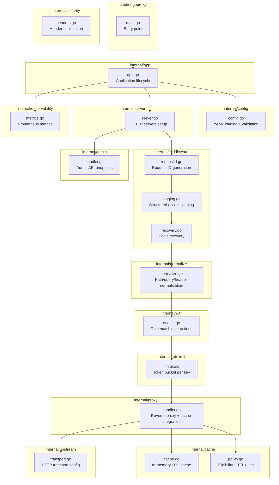
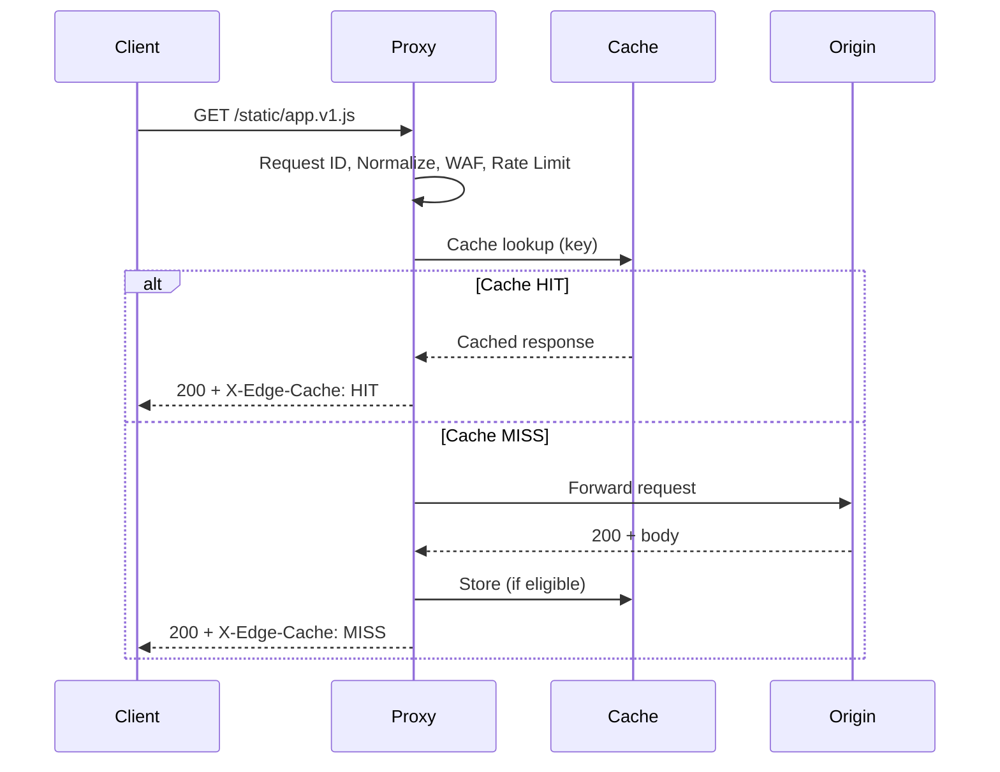
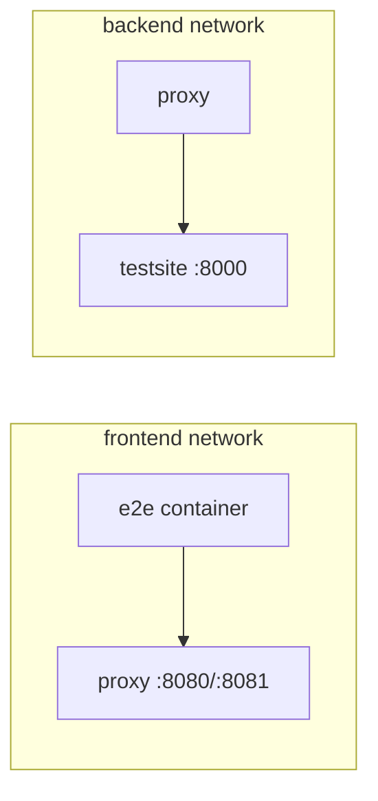

# Architecture — OpenFlare Edge Proxy POC

## Vue d'ensemble

OpenFlare est un reverse proxy HTTP L7 mono-instance, conçu comme un POC de fonctionnalités "edge proxy" :
cache HTTP, WAF, rate limiting, observabilité.

## Architecture macro

```mermaid
flowchart LR
    C[Client HTTP] --> P[Go Edge Proxy<br/>:8080 public<br/>:8081 admin]
    P -->|miss/pass| O[Python Test Site<br/>:8000]
    P --> M[/metrics<br/>Prometheus]
    P --> A[/admin/*<br/>Purge / Stats]
    T[Pytest E2E] --> P
    T -.->|référence| O
```

## Composants internes du proxy Go



## Stack technique

| Couche | Technologie | Justification |
|--------|-------------|---------------|
| Proxy | Go 1.22+ | Excellent support réseau, binaire unique |
| Origin test | Python 3.12 / FastAPI | Rapidité développement endpoints |
| Tests E2E | Python 3.12 / pytest + httpx | Framework mature pour tests HTTP |
| Conteneurs | Docker + Compose | Déploiement reproductible |
| Métriques | Prometheus client Go | Standard de facto |
| Config | YAML | Lisible, supporté nativement |

## Séparation des responsabilités

### Serveur public (:8080)

Gère le trafic proxy avec la pipeline complète :
Request ID → Limits → Normalize → WAF → Rate Limit → Cache → Proxy → Response

### Serveur admin (:8081)

Gère les opérations d'exploitation :
- Purge cache (exact, prefix, all)
- Stats cache
- Health/readiness (aussi disponible sur :8080)

### Configuration

Fichiers YAML séparés par domaine :
- `proxy.dev.yaml` : configuration runtime générale
- `rules.waf.yaml` : règles WAF
- `cache-rules.yaml` : règles de cache par path
- `rate-limit.yaml` : règles de rate limiting

## Flux de données



## Réseau Docker Compose


