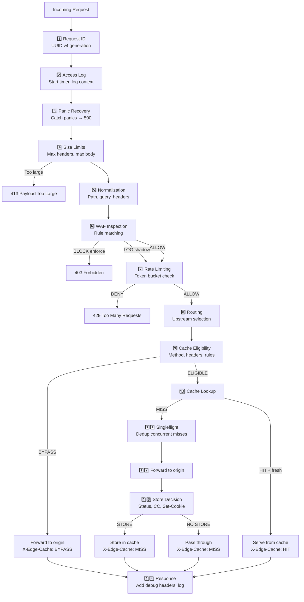

# Pipeline de requête — OpenFlare Edge Proxy POC

## Vue d'ensemble

Chaque requête HTTP entrante traverse une pipeline ordonnée de middlewares et handlers.
L'ordre est **strict** et conçu pour maximiser la sécurité et la correctness.

## Pipeline complète

## Détail par étape

### 1. Request ID

- Génère un UUID v4 unique
- Stocke dans le context Go
- Ajoute header `X-Request-ID` à la réponse
- Utilisé pour corrélation dans tous les logs

### 2. Access Log

- Démarre un timer haute résolution
- Capture : method, path, client IP, user-agent
- Log en fin de requête : status, duration, cache status, WAF action

### 3. Panic Recovery

- Catch toute panic dans les handlers downstream
- Retourne `500 Internal Server Error`
- Log le stack trace
- Garantit que le serveur ne crash pas

### 4. Size Limits

- `max_header_bytes` : configurable (défaut 1 MiB)
- `max_request_body_bytes` : configurable (défaut 10 MiB)
- Rejette avec `413 Payload Too Large` si dépassé

### 5. Normalization

- **Path** : suppression double slashes, résolution `.` et `..`, décodage percent-encoding safe
- **Query** : tri alphabétique des paramètres, décodage, suppression params vides optionnel
- **Headers** : lowercase des noms (standard HTTP/2)

### 6. WAF Inspection

- Évalue chaque règle activée contre la requête normalisée
- Match sur : path, query, headers, body (limité), IP, user-agent
- Actions :
  - `block` (mode enforce) : retourne status configuré (403)
  - `log` (mode shadow) : log l'événement, continue
  - `allow` : continue
  - `bypass_cache` : marque la requête non cacheable
- Chaque décision est loggée avec rule_id et action

### 7. Rate Limiting

- Lookup de la clé (IP, IP+path, API key)
- Token bucket : consume un token
  - Si tokens disponibles : ALLOW
  - Si bucket vide : DENY → 429 + Retry-After
- Compteurs incrémentés pour métriques

### 8. Routing

- Sélection de l'upstream basée sur la configuration
- En v1 : un seul upstream (testsite)
- Prêt pour multi-upstream dans v2

### 9. Cache Eligibility

Vérifie si la requête est éligible au cache :
- Méthode ∈ {GET, HEAD} ?
- Header `Authorization` absent ?
- Header `Cookie` absent (ou règle explicite) ?
- Rule cache: eligible ?
- WAF n'a pas marqué `bypass_cache` ?

### 10. Cache Lookup

- Calcul de la cache key
- Recherche dans le store in-memory
- Vérification fraîcheur (TTL)
- Si HIT + frais → serve directement
- Si MISS ou expiré → forward vers origin

### 11. Singleflight

- `golang.org/x/sync/singleflight` par cache key
- Si multiple requêtes concurrentes arrivent pour la même clé, une seule fetch à l'origin
- Les autres attendent et reçoivent le même résultat
- Protection anti-stampede (thundering herd)

### 12. Forward to Origin

- `httputil.ReverseProxy` configuré avec timeouts
- Headers ajoutés : `X-Forwarded-For`, `X-Forwarded-Proto`, `X-Request-ID`
- Timeout configurable par upstream

### 13. Store Decision

Vérifie si la réponse est stockable :
- Status 2xx ?
- Pas de `Cache-Control: no-store` ?
- Pas de `Cache-Control: private` ?
- Pas de `Set-Cookie` ?
- Si oui → stocke avec TTL calculé
- Si non → passe sans stocker

### 14. Response

- Ajoute `X-Edge-Cache: HIT|MISS|BYPASS|STORE|EXPIRED`
- Ajoute `X-Request-ID`
- Log l'access log final
- Incrémente les métriques
