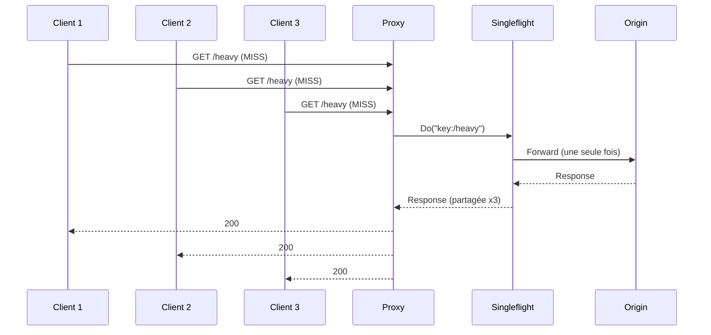

# Stratégie de Cache — OpenFlare Edge Proxy POC

## Principes fondamentaux

1. **Safety first** : en cas de doute, BYPASS plutôt que risque de fuite de données
2. **Explicite** : chaque décision de cache est traçable via headers et logs
3. **Configurable** : règles de cache par path/extension via YAML
4. **Testable** : headers `X-Edge-Cache` pour assertions E2E

## Éligibilité requête

| Condition | Résultat |
|-----------|----------|
| Méthode ≠ GET/HEAD | BYPASS |
| Header `Authorization` présent | BYPASS |
| Header `Cookie` présent | BYPASS (configurable) |
| Règle YAML `cache: eligible: false` | BYPASS |
| WAF action `bypass_cache` | BYPASS |
| Toutes conditions OK | ELIGIBLE → lookup |

## Cache Key

```
{METHOD}|{HOST}|{NORMALIZED_PATH}|{SORTED_QUERY}|{ACCEPT_ENCODING}
```

### Normalisation de la clé

- **Method** : GET et HEAD traitées comme GET pour la clé
- **Host** : lowercase
- **Path** : suppression double slashes, résolution dots, lowercase
- **Query** : tri alphabétique des params, décodage, suppression doublons
- **Accept-Encoding** : normalisé en catégories (gzip, br, identity)

## Éligibilité réponse (stockage)

| Condition réponse | Stockable ? |
|-------------------|-------------|
| Status 200-299 | ✅ |
| Status autre | ❌ |
| `Cache-Control: no-store` | ❌ |
| `Cache-Control: private` | ❌ |
| `Cache-Control: no-cache` | ❌ (v1 simplifié) |
| Header `Set-Cookie` présent | ❌ |
| Aucune interdiction | ✅ si TTL déterminable |

## Calcul du TTL

Ordre de priorité :

1. **Règle YAML** avec `ttl_seconds` pour le path/extension matching
2. **`Cache-Control: s-maxage=N`** de la réponse origin
3. **`Cache-Control: max-age=N`** de la réponse origin
4. **TTL par défaut** (`default_ttl_seconds` config, défaut 30s)

## Headers de debug

| Header | Valeurs | Description |
|--------|---------|-------------|
| `X-Edge-Cache` | `HIT` | Servi depuis le cache |
| | `MISS` | Non trouvé, fetché depuis origin |
| | `BYPASS` | Non éligible au cache |
| | `EXPIRED` | Trouvé mais expiré, re-fetch |
| `X-Request-ID` | UUID | Identifiant unique de la requête |

## Stockage in-memory

### Structure

```go
type CacheEntry struct {
    Key          string
    StatusCode   int
    Headers      http.Header
    Body         []byte
    StoredAt     time.Time
    TTL          time.Duration
    Size         int64
}
```

### Limites

| Paramètre | Défaut | Configurable |
|-----------|--------|-------------|
| `max_entries` | 5000 | ✅ |
| `max_bytes` | 256 MiB | ✅ |

### Éviction

- Politique **LRU** (Least Recently Used)
- Déclenchée quand `max_entries` OU `max_bytes` atteint
- Éviction d'un seul entry à la fois (la plus ancienne LRU)

## Singleflight (anti-stampede)



## Purge

| Endpoint | Méthode | Description |
|----------|---------|-------------|
| `/admin/cache/purge` | POST | Purge par clé exacte ou URL |
| `/admin/cache/purge-prefix` | POST | Purge toutes les entrées dont le path commence par le préfixe |
| `/admin/cache/purge-all` | POST | Purge complète (dev/test uniquement) |
| `/admin/cache/stats` | GET | Statistiques cache (entries, size, hit rate) |

## Interface backend

```go
type CacheBackend interface {
    Get(key string) (*CacheEntry, bool)
    Set(key string, entry *CacheEntry)
    Delete(key string) bool
    DeleteByPrefix(prefix string) int
    Purge() int
    Stats() CacheStats
    Len() int
}
```

Cette interface permet de remplacer le backend in-memory par disk ou Redis dans les versions futures.
