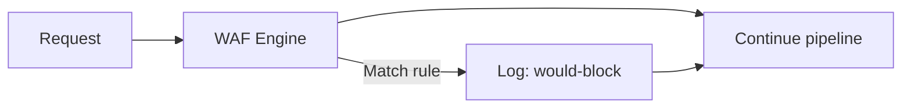
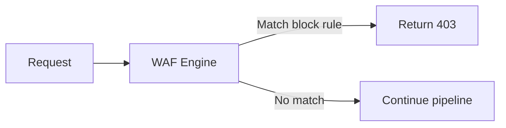
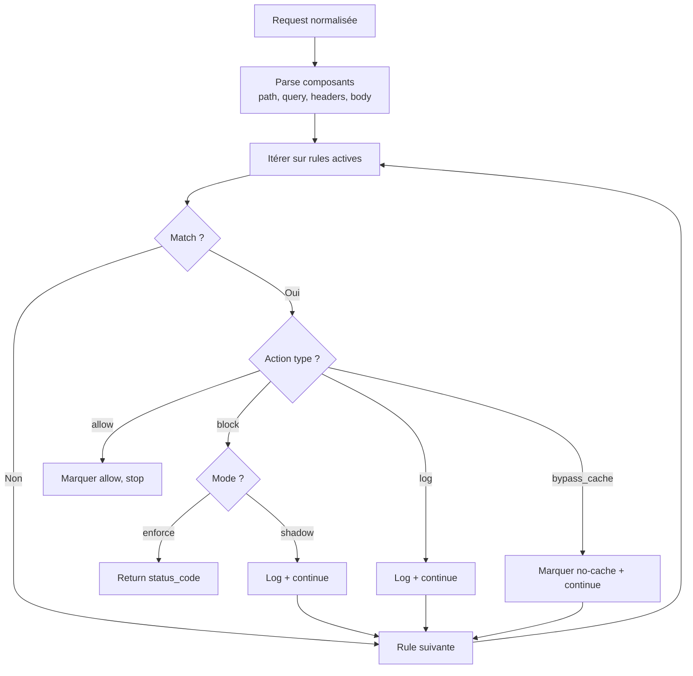

# Stratégie WAF — OpenFlare Edge Proxy POC

## Principes

1. **Règles explicites** : pas de moteur signature magique, chaque règle est lisible et testable
2. **Modes shadow et enforce** : permet de tester sans bloquer, puis d'activer le blocage
3. **Sécurité du moteur** : bornes sur regex, limites de body, normalisation documentée
4. **Auditabilité** : chaque décision est loggée avec rule_id, action, et contexte

## Modes de fonctionnement

### Mode Shadow (log-only)



- La requête n'est **jamais bloquée**
- Un log WAF est émis avec le détail de la règle matchée
- Utile pour tester et tuner les règles avant activation

### Mode Enforce



- Les requêtes matchant une règle `block` sont **bloquées**
- Les règles `log` restent en log-only même en mode enforce
- Les règles `allow` explicites court-circuitent les autres

## Structure des règles

```yaml
rules:
  - id: "unique-rule-id"        # Identifiant unique
    enabled: true                 # Activation
    phase: "request"              # Phase d'inspection
    description: "Description"    # Documentation
    match:
      any:                        # OR entre les conditions
        - path_regex: "pattern"
        - query_regex: "pattern"
        - header_name: "value"
        - header_regex: "name:pattern"
        - ip_cidr: "10.0.0.0/8"
        - method: "DELETE"
        - user_agent_regex: "pattern"
        - body_regex: "pattern"
        - content_type: "application/json"
    action:
      type: "block"              # block | log | allow | bypass_cache
      status_code: 403           # Pour block uniquement
      log: true                  # Toujours logger la décision
```

## Règles v1 par défaut

### 1. Block Path Traversal

```yaml
- id: "block-path-traversal"
  enabled: true
  phase: "request"
  description: "Block directory traversal attempts"
  match:
    any:
      - path_regex: "(?i)(\\.\\./|%2e%2e%2f|%2e%2e/|\\.\\.%2f)"
  action:
    type: "block"
    status_code: 403
    log: true
```

### 2. Block SQL Injection (basic)

```yaml
- id: "block-sqli-basic"
  enabled: true
  phase: "request"
  description: "Block basic SQL injection patterns"
  match:
    any:
      - query_regex: "(?i)(union\\s+select|or\\s+1\\s*=\\s*1|drop\\s+table|;\\s*--)"
      - body_regex: "(?i)(union\\s+select|or\\s+1\\s*=\\s*1|drop\\s+table|;\\s*--)"
  action:
    type: "block"
    status_code: 403
    log: true
```

### 3. Shadow XSS (basic)

```yaml
- id: "shadow-xss-basic"
  enabled: true
  phase: "request"
  description: "Log basic XSS patterns (shadow mode)"
  match:
    any:
      - query_regex: "(?i)(<script|javascript:|onerror\\s*=)"
      - body_regex: "(?i)(<script|javascript:|onerror\\s*=)"
  action:
    type: "log"
    log: true
```

## Pipeline d'inspection



## Normalisation avant inspection

### Transformations appliquées (dans cet ordre)

1. **URL decode** du path (une passe)
2. **Lowercase** du path
3. **Suppression** double slashes
4. **Résolution** dot segments (`/.` et `/..`)
5. **URL decode** de la query string
6. **Lowercase** des noms de headers

### Pourquoi une seule passe de décodage ?

Le double encoding (`%252e%252e` → `%2e%2e` → `..`) est un vecteur d'attaque classique.
En v1, on décode une seule fois et on matche. Les règles doivent couvrir les formes encodées courantes.

## Sécurité du moteur WAF

### Anti-ReDoS

- Les regex sont **compilées au démarrage** (pas à chaque requête)
- Utilisation du moteur `regexp` Go (RE2, pas de backtracking exponentiel)
- Les regex RE2 ne sont pas vulnérables aux attaques ReDoS classiques

### Limites de body

- `max_body_inspect_bytes` : configurable (défaut 64 KiB)
- Au-delà, le body n'est **pas inspecté** (log warning)
- Cela évite de charger des uploads gros en mémoire pour inspection

### Logging d'audit

Chaque décision WAF est loggée avec :
- `rule_id`
- `action` (allow/block/log/bypass_cache)
- `match_detail` (quel champ a matché)
- `request_id`
- `client_ip`
- `path`

## Limitations connues

| Limitation | Impact | Mitigation |
|-----------|--------|-----------|
| Règles simples (pas OWASP CRS) | Faible couverture | Documenté, extensible |
| Un seul décodage URL | Double encoding possible | Règles couvrant formes encodées |
| Pas d'inspection multipart | Upload non inspecté | Limite taille, future version |
| Pas de scoring | Pas de seuil cumulatif | Règles binaires, simple et prévisible |
